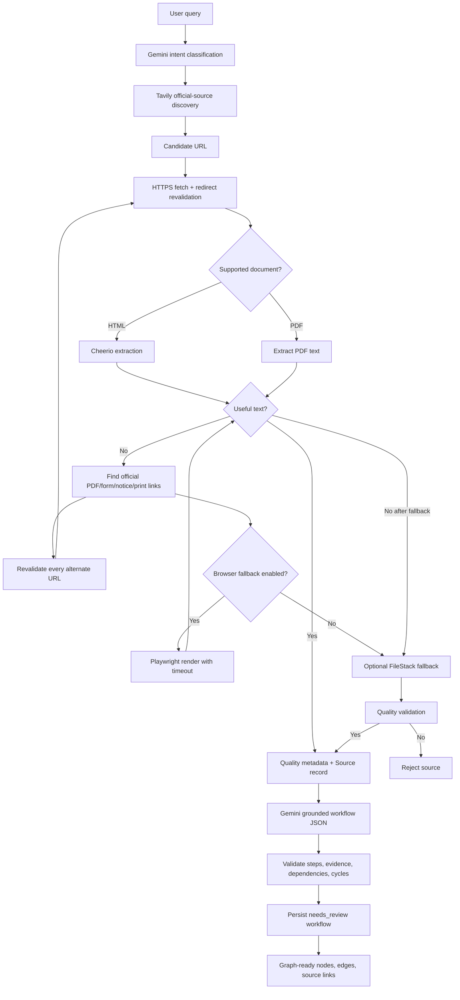

# CivicPath Government-Source Extraction Improvements

## A. Root cause

The original pipeline treated an HTTP 200 response as usable source material. It fetched one URL, removed HTML tags with Cheerio, and sent `body.text()` to Gemini. MCGM/iView-style pages often return a JavaScript/browser shell rather than the civic content. The shell can contain text such as `Could not open iView`, `Please wait`, or `enable JavaScript`, so Gemini receives a technically successful but substantively empty document.

Cheerio is an HTML parser, not a browser: it cannot execute the JavaScript required to populate a client-rendered page. Gemini 503/high-demand errors are a separate transient provider issue and are still handled by the existing retry logic.

## B. What changed

1. **Quality gate before Gemini**
   - Detects empty, very short, low-word-count, loading, browser-compatibility, and iView placeholder pages.
   - Returns a structured `SOURCE_CONTENT_UNUSABLE` error with attempted URLs and rejection reasons.
   - A rejected source is never persisted as a successful source and never sent to Gemini.

2. **Safe multi-strategy retrieval**
   - Strategy 1: HTTPS fetch with bounded size, timeout, redirect count, user agent, and content-type handling.
   - Strategy 2: inspect the official page for likely downloadable forms, notices, circulars, print pages, and PDF/document links; each alternate URL is independently validated by the existing SSRF/domain guard.
   - Strategy 3: optional Playwright rendering for JavaScript-heavy pages. It is disabled by default and only runs when `ENABLE_BROWSER_FALLBACK=true` and Playwright/Chromium are installed in the deployment image.

3. **PDF compatibility**
   - Handles the class-based API shipped by the current `pdf-parse` v2 dependency and remains compatible with older function-style exports.

4. **Backend-owned provenance**
   - The original Tavily candidate remains the Source document's `url`.
   - The actual resource that supplied text is recorded separately as `resolvedUrl`.
   - `retrievalMethod`, quality metrics, and attempted URLs are stored for review and debugging.
   - Gemini is explicitly instructed to return `officialUrl: null`; the backend derives every workflow step URL from its source IDs and Source records.

5. **Graph-ready output remains intact**
   - Existing `toGraphJson()` output still contains `nodes`, `edges`, conflicts, missing information, `sourceIds`, and a backend-derived `officialUrl`.

6. **Optional FileStack normalization fallback**
   - Added `src/services/filestack.service.js` using FileStack's documented `output=format:txt` conversion URL.
   - It is disabled by default with `ENABLE_FILESTACK_FALLBACK=false`.
   - It runs only after native extraction, alternate official documents, and optional browser rendering fail.
   - FileStack output is subject to the same CivicPath quality gate before Gemini.
   - The original government URL remains the workflow's official link; FileStack is recorded only as an intermediary.

7. **Free local multi-format extraction**
   - Text PDFs use `pdf-parse` first.
   - Scanned/image-only PDFs can fall back to OCR using `pdftoppm` plus Tesseract.
   - PNG/JPEG/TIFF/BMP/WEBP sources can use local Tesseract OCR.
   - DOC/DOCX/XLS/XLSX/PPT/PPTX/ODT/ODS/ODP sources can be normalized to text using headless LibreOffice.
   - Plain text, CSV, JSON, XML, and HTML are handled without external conversion.
   - The exact method is stored as `Source.extractionMethod` for debugging and quality analysis.

8. **Page-aware civic chunks and evidence**
   - Native and fallback extraction now returns page records and bounded chunks with page ranges, character offsets, civic section type, and priority.
   - Civic sections include eligibility, documents required, procedure, fees, deadline, office/contact, service area, forms/portals, and appeals/grievances.
   - Gemini receives chunk metadata rather than only an arbitrary text prefix.
   - Gemini evidence anchors are checked against backend-owned chunks before being saved or exposed in graph nodes.
   - Quality metadata now includes language signal, Devanagari ratio, replacement-character ratio, and legacy-font suspicion.

## C. Files changed

- `src/services/extraction.service.js` — multi-strategy retrieval, content scoring, placeholder detection, alternate links, browser fallback, PDF compatibility.
- `src/services/gemini.service.js` — prevents model-authored official URLs.
- `src/services/workflow.service.js` — persists extraction evidence, rejects stale/legacy sources without quality metadata, and derives URLs from source records.
- `src/models/Source.js` — provenance and quality fields.
- `src/services/filestack.service.js` — optional FileStack conversion adapter.
- `.env.example` — new quality/fallback settings.
- `tests/extraction.service.test.js` — extraction regression coverage.
- `tests/filestack.service.test.js` — offline FileStack adapter tests.
- `tests/fixtures/ocr-government-form.png` — deterministic OCR fixture.
- `src/services/civicChunker.js` — civic section detection and page-aware chunking.
- `tests/civicChunker.test.js` — section, provenance, and legacy-font tests.
- `.env.example` — OCR, Office conversion, and page/time limits.
- `EXTRACTION_PIPELINE_REPORT.md` — this report.

## D. Why it is more reliable

The pipeline now distinguishes **fetch success** from **content usefulness**. One bad government page no longer poisons the Gemini prompt: it is rejected, alternate official documents are tried, and the next Tavily candidate can be attempted by the existing orchestration loop. Browser rendering is an explicit deployment option rather than an assumption that Cheerio can execute JavaScript.

## E. JavaScript-heavy/iView handling



Browser fallback is not a bypass for security: the initial URL and every discovered/redirected URL still pass HTTPS, allowlist, DNS, private-IP, redirect-count, timeout, and size checks. Some portals may still require authentication, a challenge/CAPTCHA, a session, or a human review; those are correctly reported as unavailable rather than fabricated.

For local conversion, the runtime needs free OS packages:

```bash
sudo apt-get install -y tesseract-ocr poppler-utils libreoffice
```

These are not npm dependencies because they are system binaries and are best installed in the deployment image. OCR is bounded by `OCR_MAX_PAGES`, `OCR_DPI`, and `OCR_TIMEOUT_MS`; Office conversion is bounded by `OFFICE_TIMEOUT_MS`.

## F. Source-quality validation

`assessContentQuality()` records:

- `usable`
- normalized quality `score`
- rejection `reasons`
- character and word counts

Default thresholds are 160 characters and 25 words. They can be adjusted in `.env` for a deployment's document style. Placeholder patterns include iView/browser incompatibility, `Please wait`, JavaScript-required messages, browser checks, and similar shell text.

## G. URL preservation

`Source.url` remains the URL discovered by Tavily. `Source.resolvedUrl` records the final redirect or alternate document that supplied extracted text. Workflow `officialUrl` is derived from the Source record selected by `sourceIds`; Gemini cannot invent or replace it.

## H. Security considerations

- HTTPS-only URLs remain required.
- Municipality allowlists remain required when configured.
- DNS resolution and private/reserved/link-local/cloud-metadata IP blocking remain unchanged.
- Every redirect and alternate document URL is revalidated.
- Fetches are bounded by timeout, redirect count, and maximum bytes.
- Browser fallback is off by default, headless, bounded by navigation timeout, and only available when explicitly installed/enabled.
- FileStack fallback is off by default, uses a server-side API key, validates output size and format, and does not replace the original official URL.
- No API key, database password, or `.env` file is included in the deliverable.

## I. Local test instructions

```bash
cd civicpath-working-copy
cp .env.example .env
# Fill in MONGO_URI, GEMINI_API_KEY, and TAVILY_API_KEY as needed.
npm install
npm test
```

The included test suite is offline and covers normal HTML, placeholder rejection, alternate official links, PDF extraction, URL security, health, workflow validation, and cycle detection. To enable browser fallback in a deployment image:

```bash
npm install playwright
npx playwright install chromium
ENABLE_BROWSER_FALLBACK=true npm start
```

Install Chromium only in an environment designed to run it; it increases image size, memory use, and cold-start time.

The local test suite verifies normal HTML, text PDF, scanned-image OCR, LibreOffice normalization, placeholder rejection, alternate official links, URL security, FileStack adapter behavior, health, workflow validation, civic section classification, provenance chunking, and cycle detection. The current result is **22 passing tests**.

## Live government-source smoke tests after civic chunking

The implementation was also tested against real official sources:

| Source | Result | Method | Notes |
|---|---|---|---|
| MEA Know India Programme application PDF | Passed | `pdf-ocr` | 3,798 characters, 657 words, quality score 0.977, 2 civic chunks |
| NITI Aayog official DOCX | Passed | LibreOffice | 1,588 characters, 230 words |
| NITI Aayog official XLSX | Passed after spreadsheet fix | LibreOffice → CSV | 2,121 characters, 157 words; spreadsheet output is flattened CSV text |
| `india.gov.in` homepage | Rejected | HTTPS fetch | Host returned HTTP 403 to the backend client |
| NITI Aayog HTML/download URLs | Rejected with default bot UA | HTTPS fetch | Host returned HTTP 403; a browser-like `SOURCE_USER_AGENT` allowed the NITI Office files |

The 403 cases are not parser failures. The host is refusing the request before content is returned. The project supports `SOURCE_USER_AGENT` so deployments can use a transparent, policy-compliant user-agent appropriate to their organization. This does not bypass authentication or CAPTCHA.

The XLSX test exposed and fixed a real issue: LibreOffice text output can fail for spreadsheets in headless mode. Spreadsheets now use an isolated LibreOffice profile and CSV conversion, while DOC/DOCX/PPT/PPTX/ODF text documents continue using text conversion. Spreadsheet formulas, multiple-sheet structure, and formatting are not preserved in the flattened text output.

To enable FileStack normalization:

```bash
FILESTACK_API_KEY=your_key \\
ENABLE_FILESTACK_FALLBACK=true \\
npm start
```

The added tests use an injected HTTP client and do not contact FileStack. A live FileStack test requires the user's own API key and account; no FileStack credential was available in this sandbox, so no paid/external conversion was attempted.

The live smoke-test script is `scripts/filestack-live-smoke.js`. It defaults to the official Maharashtra Chief Electoral Officer Form-6A PDF and can be run with:

```bash
FILESTACK_API_KEY='your_key_here' npm run test:filestack:live
```

Or supply another validated government PDF URL:

```bash
FILESTACK_API_KEY='your_key_here' \\
npm run test:filestack:live -- https://example.gov.in/path/document.pdf
```

The script validates the source through CivicPath's HTTPS, DNS, private-IP, and government-domain protections, checks FileStack output quality, matches expected terms from the sample form, and never prints the FileStack API key or generated conversion URL.

## K. Is FileStack useful here?

It is a **useful but narrow addition**. It can help normalize an unusual document format into plain text and may improve coverage for files that the local parser cannot read. The free local OCR and LibreOffice paths reduce the need for FileStack for common PDFs and Office files. FileStack does not solve JavaScript portals, CAPTCHA/authenticated pages, or poor source discovery. Enabling it globally would add latency, external data handling, and possible usage cost without improving those common cases.

Recommendation: keep it disabled by default and enable it for deployments that encounter a measurable volume of unsupported government document formats. Track `retrievalMethod`, quality score, Gemini validation rate, latency, and conversion failures before making it the default.

## J. Remaining limitations

- A source requiring authentication, CAPTCHA, a user session, or a proprietary client may still be rejected.
- Browser rendering is more expensive and is not included by default.
- Some portals expose data through XHR/API calls that are not linked in the HTML. Those may need a portal-specific adapter after verifying the official API and its terms.
- Scanned/image-only PDFs need OCR; the current parser handles text PDFs.
- OCR quality depends on scan resolution, language packs, layout, tables, and handwriting; OCR output must remain needs-review.
- LibreOffice conversion can lose spreadsheet formulas, table structure, slide layout, and document styling; use it to recover text, not preserve legal formatting.
- A live smoke test against the sample Maharashtra PDF in this sandbox was blocked by that host's TLS certificate verification (`unable to verify the first certificate`). The pipeline correctly rejected it rather than disabling certificate verification. This is a host/deployment connectivity issue, not evidence that TLS should be weakened.
- No public website can be guaranteed to remain stable. Persisted workflows remain `needs_review` and should be human-verified before being treated as authoritative.
- The sandbox copy was tested without live Tavily/Gemini/FileStack calls, so credentials, account limits, and production network behavior must be tested in the user's deployment environment.
